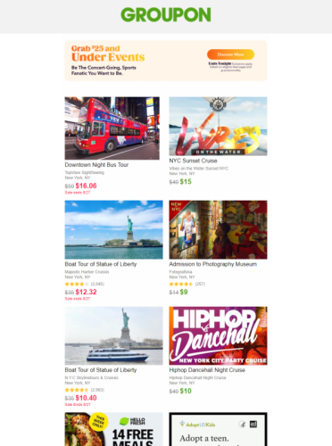
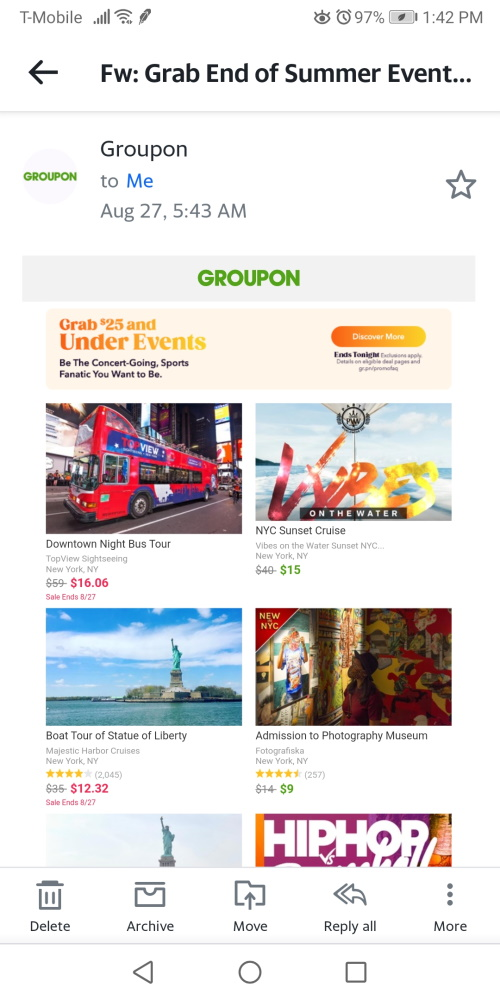

# Groupon End of Summer Events Deals promo
A full mockup of a Groupon marketing email. 

# Technologies used
Zurb Foundations for Email, HTML, CSS (SCSS), Javascript. Tested with Litmus' [Putsmail](https://putsmail.com/)

# Completed Email
Click [here](https://groupon-endofsummer-deals.netlify.app/) to view the completed email. 

**This version is responsive**. I'm sure Groupon has a reason why they didn't make their email responsive (phones, in portrait mode only), so I took creative liberty and made it responsive. You can view it either on a real mobile device or use your browser's dev tools.


<a href="https://groupon-endofsummer-deals.netlify.app/"></a>

---

# Original Email Preview
Click the picture to see the full image of the original email.

<a href="./screenshot/screenshot-full-email.png"></a>


## Mobile View
The original mobile email is **not** responsive. This is a preview of that email from the Yahoo mail app.



---

# Layout outline
I'm only guessing what Groupon actually does in their template. Based on the ads from a third party in the middle of the page, I separated the first 6 deals into a **"Top 6"** section, and the rest are in another section, for a total of **24 deals**. From what I've seen in other Groupon emails, the amount of deals advertised can vary, but they're always an even number.


| Col 1  | Col 2  |
|---|---|
|Top 6 Deal# 1  | Top 6 Deal # 2|
|.....  | Top 6 Deal # 6|
|   <center>Ads<center>   | Ads | 
| More Deals # 1 | More Deals # 2 |
| |..... | |.....|
| More Deals # 17 | More Deals # 18 |


# Template logic
The template uses the [Handlebars built-in helpers](https://handlebarsjs.com/guide/builtin-helpers.html) to handle the logic behind what is displayed on the page, depending on the JSON data present in the object's index number. If the information in the JSON data is either blank ("") or `false`, the item does not show up on the template. Some of the data serves more as conditional values than real values used in the template.

**Example Column**
```html
    <columns>
            {{#with deals.deals6.[0] as | deals6 |}}
            <a href="{{this.deal_link}}">
                
            </a>
            <h3>{{this.title}}</h3>
            <p class="small-text company-text">{{this.company}}</p>
            <p class="small-text location-text">{{this.location}}</p>
            <!-- Star Rating Info -->
            {{#if this.starRating}}
            <table>
                <tr>
                    <td class="stars-container"></td>
                    <td class="ratings-container"><p class="small-text rating-text">({{this.ratingsInfo.number_reviews}})</p></td>
                </tr>
            </table>
            {{/if}}
            <!-- Active Deal Info-->
            {{#unless this.expiring}}
                {{#if this.originalPrice}}
                <table class="active-deal__container">
                    <tr>
                        <td><span class="strike">{{this.originalPrice}}</span><span class="green-deal__text">{{this.dealPrice}}</span></td>
                    </tr>
                </table>
                {{else}}
                <table class="active-deal__container">
                    <tr>
                        <td><span class="green-deal__text">{{this.fromPrice}}</span></td>
                    </tr>
                </table>
                {{/if}}
            {{/unless}}         
            <!-- Extra/Miscellaneous info -->
            {{#if this.extra_info}}
            <p class="expiring-deal__info">{{this.extra_info}}</p>
            {{/if}}
            <!-- Expiring Deal Info -->
            {{#if this.expiring}}
            <table class="expiring-price__container">
                <tr>
                    <td><span class="strike">{{this.originalPrice}}</span><span class="expiring-price-number">{{this.dealPrice}}</span></td>
                </tr>
                <tr><td colspan="1"><p class="expiring-deal__info">{{this.expiring_info.saleEndInfo}}</p></td></tr>
            </table>   
            {{/if}}
            {{/with}}
    </columns>
```

Here's some JSON data that would be placed in template.
```JSON
    {
    "title":"Hiphop Dancehall Night Cruise",
    "company":"Hiphop Dancehall Night Cruise",
    "location":"New York, NY",
    "originalPrice":"$40",
    "dealPrice":"$10",
    "fromPrice":"",
    "img_url":"https://i.postimg.cc/PxpnNq2P/hiphop-dancehall.jpg",
    "expiring":"",
    "expiring_info":{
        "saleEndInfo":""
    },
    "starRating": "",
    "ratingsInfo":{
        "stars":"4.5",
        "starsImgUrl":"https://i.postimg.cc/g0sfgZBw/stars-4point5.png",
        "number_reviews":"2,063"
    },
    "extra_info":false,
    "deal_link":"https://www.groupon.com/deals/hip-hop-dancehall-top-40-mix-cruise-1?p=8&utm_source=channel_occasions_im&utm_medium=email&t_division=new-york&date=20210827&uu=873e65a0-4503-11e5-b3ae-002590980766&CID=US&tx=0&s=body&c=image&d=deal-page&utm_campaign=f77f0836-d6eb-437f-8209-47f61dd4022c_0_20210827"
    }

```


# Copyright Notice
I do not claim ownership the design, or any of the logos within this project. This is purely for educational purposes.
