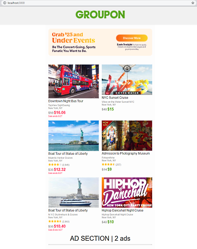

# Groupon End of Summer Events Deals promo
A full mockup of a Groupon marketing email. 

# Technologies used
Zurb Foundations for Email, HTML, CSS (SCSS), Javascript.

# Original Email Preview
Click the picture to see the full image of the original email.

<a href="./screenshot/screenshot-full-email.png"></a>

---
# Current Status
Click the picture to see the full image of the current status. 

<a href="./screenshot/current_aug28.png"></a>

# Layout outline
I'm only guessing what Groupon actually does in their template. Based on the ads from a third party in the middle of the page, I separated the first 6 deals into a **"Top 6"** section, and the rest are in another section, for a total of **24 deals**. From what I've seen in other Groupon emails, the amount of deals advertised can vary, but they're always an even number.


| Col 1  | Col 2  |
|---|---|
|Top 6 Deal# 1  | Top 6 Deal # 2|
|.....  | Top 6 Deal # 6|
|   <center>Ads<center>   | Ads | 
| More Deals # 1 | More Deals # 2 |
| More Deals # 17 | More Deals # 18 |


# Template logic
The template uses the [Handlebars built-in helpers](https://handlebarsjs.com/guide/builtin-helpers.html) to handle the logic behind what is displayed on the page, depending on the JSON data present in the object's index number. 

**Example Column**
```html
<columns large="6">
            
            <h3>{{deals.deals18.[0].title}}</h3>
            <p class="small-text">{{deals.deals18.[0].company}}</p>
            <p class="small-text">{{deals.deals18.[0].location}}</p>
            <!-- Star Rating Info -->
            {{#if deals.deals18.[0].starRating}}
            <p><span style="display:inline-block;"></span><span class="small-text" style="display:inline-block;">({{deals.deals18.[0].ratingsInfo.number_reviews}})</span></p>
            {{/if}}
            <!-- Active Deal Info-->
            {{#if deals.deals18.[0].originalPrice}}
            <span class="strike">{{deals.deals18.[0].originalPrice}}</span><span class="green-deal__text">{{deals.deals18.[0].dealPrice}}</span>
            {{else}}
            <span class="green-deal__text">{{deals.deals18.[0].fromPrice}}</span>
            {{/if}}
            <!-- Extra/Miscellaneous info -->
            {{#if deals.deals18.[0].extra_info}}
            <p class="expiring-deal__info">{{deals.deals18.[0].extra_info}}</p>
            {{/if}}
            <!-- Expiring Deal Info -->
            {{#if deals.deals18.[0].expiring}}
            <span class="strike">{{deals.deals18.[0].originalPrice}}</span><span class="expiring-price-number">{{deals.deals18.[0].dealPrice}}</span>
            <p class="expiring-deal__info">{{deals.deals18.[0].expiring_info.saleEndInfo}}</p>
            {{/if}}
        </columns>
```

# Javascript Helpers
I'm hoping to develop some JS helpers in order to allow for easier customization of the template. This would include iterating through all of the JSON data. Unfortunately, I cannot use the built in `{{#each}}` helper, as each column is built, it creates columns in a horizontal direction until all the data is displayed, which doesn't match the layout at all.
*Example*:

| Col 1  | Col 2  | Col 3 | Col 4 | Col 5 | etc....


## Possible fix
If I can mimic the `#each` helper, but force it to build this sort of layout, by creating 2 columns, within 1 row, then I can make 12 helpers, and each would start at an index number offset of +2 from the preceding helper.
*Example (psuedocode)*: 
```
{{for each object in deals.deals6 (the JSON file)}}
//start with a table
// add a row
// add a column
// add the data

<h3>{{this.title}}</h3>
<p class="small-text">{{this.company}}</p>
<p class="small-text">{{this.location}}</p>
....etc
// end the column
// start new column
// add the data

<h3>{{this.title}}</h3>
<p class="small-text">{{this.company}}</p>
<p class="small-text">{{this.location}}</p>
....etc
// end the column
// end the row

```

# Core Data
Coming soon.

# Copyright Notice
I do not claim ownership the design, or any of the logos within this project. This is purely for educational purposes.
